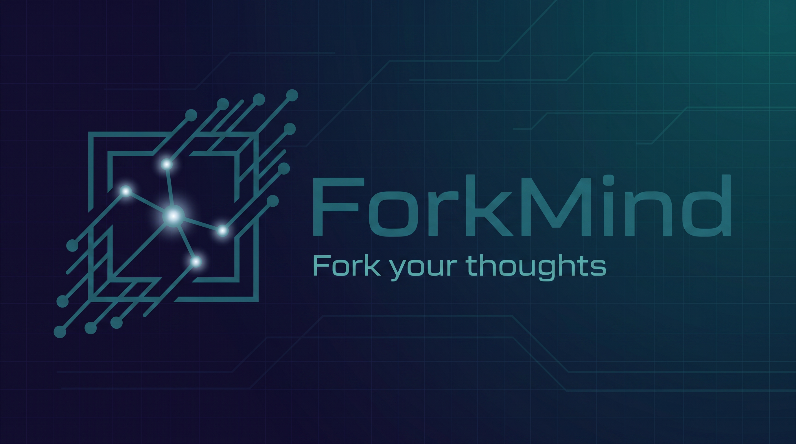

# 🌿 ForkMind (分叉思维)



> **Break free from linear chats. Fork your thoughts.**
> 摆脱线性对话的束缚，让你的 AI 灵感在无限画布上自由分叉。


## 💡 为什么需要 ForkMind？

在使用传统的大模型（如 ChatGPT, Claude）进行深度学习、代码 debug 或复杂逻辑梳理时，我们经常面临“上下文污染（Context Pollution）”与“无尽滚动（Endless Scrolling）”的地狱：

- 当你在一个长对话中突然想追问一个衍生知识点（如概念 α 和 β），AI 的上下文会被瞬间带偏。
- 当追问结束后想回到主线，你不得不疯狂向上滚动寻找历史记录。

**ForkMind 彻底重构了人机交互形态。** 我们将传统的“线性对话”降维打击为“网状节点（Node-based Graph）”。在这里，你的每一次追问都是对思维的一次 `Fork`（分叉）。

## ✨ 核心特性 (Core Features)

- 🎨 **无限画布空间 (Infinite Canvas)**：左侧管理会话，中间是无边界可拖拽画布，右侧编辑当前节点。告别上下翻滚，全局思维脉络一目了然。
- 🔀 **独立上下文分支 (Isolated Context Chains)**：
  - 从对话卡片 A 中引出追问卡片 B。
  - **核心算法**：采用 **树的向上遍历（Upward Tree Traversal）** 算法。卡片 B 仅继承 A 及 A 的祖先节点作为上下文，其他兄弟分支互不干扰。
- 🔌 **OpenAI-compatible & 本地模型优先**：
  - 仅依赖标准 `/chat/completions` 流式接口，可连接本地 `Ollama` 或用户自行配置的兼容服务。
  - API Key 只保存在当前运行时内存，不写入工作区文件；Go 网络层规避浏览器 CORS 与 Mixed Content 限制。
- 💾 **Local-First 数据流 (JSON 驱动)**：
  - 无需注册，无需云端服务器。画布与对话数据采用最原始的 `.json` 格式存储在本地。
  - **极客友好**：用户可随意导出、分享、甚至使用 VSCode 手动二次编辑对话节点树。

## 🛠 技术架构 (Tech Stack)

ForkMind 采用极其轻量且高性能的跨平台桌面端架构：

- **核心框架**: [Wails](https://wails.io/) (基于 Go 的轻量级桌面端应用框架，替代臃肿的 Electron)
- **前端生态**: React 18 + Vite
- **状态管理**: Zustand (在内存中维护对话节点树结构)
- **AI 交互层**:
  - Go 侧组装 `parentId` 主链与 `referenceNodeIds` 补充参考资料。
  - OpenAI-compatible SSE 流式输出，支持取消、错误分类和重新生成。
- **本地数据层**:
  - 用户配置目录中的 `workspace.json + threads/*.json`，采用临时文件与 `.bak` 恢复策略。
  - 支持完整工作区单文件导入导出与 ForkMind JSON 系统剪贴板。

## ⚙️ 底层原理：AI 是如何读取上下文的？

ForkMind 在发起对话请求时，会在内存中执行以下操作：

1. **定位当前节点**，顺着 `parentId` 指针执行向上遍历（Upward Traversal），直至根节点。
2. 将这条纯净的历史线翻转，拼接成完整的消息数组。
3. 在数组第 0 项注入**系统提示词 (System Prompt)**，规范 AI 在无限画布环境下的回答行为。
4. 交由 Go 底层向大模型 API 发起请求，确保通信安全与极速响应。

## 🧭 开发阶段（长期版本）

- [x] 阶段 0：工程基线稳定（依赖可安装、项目可构建、工具链版本对齐）。
- [x] 阶段 1：数据模型定稿（`BaseNode/ChatNode/NoteNode` 可扩展类型、`parentId` 主链、`referenceNodeIds` 参考链、位置与尺寸字段）。
- [x] 阶段 2：Zustand 业务操作层（语义化 actions、`activeNodeId` 选中态、`undo/redo` 历史栈、防成环父子关系校验、Figma 风格删除降级策略）。
- [x] 阶段 3：单页三栏 UI 壳（左侧会话栏/中间无限画布/右侧编辑栏，左右栏可收起；右栏由 `activeNodeId` 驱动，`chat` 双框与 `note` 单框切换，可选 `motion` 实现切换动画）。
- [x] 阶段 4：画布与节点面板联动（tldraw 节点和 Store 双向同步；选中节点即编辑目标；拖拽保持市面常见无限画布交互心智；支持按住拖拽绘制卡片尺寸，贴近 Figma 创建手感；右键菜单替换为 ForkMind 自定义业务菜单）。
- [x] 阶段 5：Markdown 渲染与编辑体验（画布卡片渲染 Markdown / GFM / LaTeX / Shiki 代码高亮；右栏编辑与卡片内容保持单一数据源）。
- [x] 阶段 6：多会话管理（新建、切换、重命名、删除、独立撤销栈与首次 Prompt 自动标题）。
- [x] 阶段 7：Wails Bridge 契约层（React DTO 与 Go DTO 对齐、统一错误协议、前端严格边界包装）。
- [x] 阶段 8：Go 上下文组装算法（`parentId` 主链遍历 + `referenceNodeIds` 参考注入；文本锚点延期）。
- [x] 阶段 9：模型调用层（OpenAI-compatible `/chat/completions`、SSE、取消与运行时 API Key）。
- [x] 阶段 10：本地 JSON 持久化与 JSON 剪贴板（自动保存、损坏恢复、完整导入导出、系统剪贴板 validate / normalize）。
- [x] 阶段 11：质量收敛与发布准备（Go 单测、错误码、类型检查与生产构建验证）。

## 🔭 未来展望 (Roadmap)

- [x] 单个对话支持多个根节点；当根节点过多时，提示用户“建议新开对话”。
- [ ] 支持把当前对话中的部分卡片复制到其他对话，实现无缝迁移。
- [x] 引入“关联边/引用边（Reference Edge）”，满足自由联想与跨分支关系表达。
- [x] 固化“主链 + 参考资料”上下文策略：`parentId` 负责主链遍历，`referenceNodeIds` 以“补充参考资料”形式注入提示词。
- [ ] 支持在卡片文本中选中词/句直接追问：从选中内容拉线创建新卡片，并记录引用锚点。
- [ ] 支持扩展卡片类型：图片卡片（Image Node）、链接卡片（Link Node）、文件卡片（File Node）等。

## 🚀 快速开始 (Quick Start)

### 1) 环境准备

- Node.js: 建议 `20+`
- npm: 建议 `10+`
- Go: 建议 `1.22+`
- Wails CLI: `v2`

安装 Wails CLI（首次）：

```bash
go install github.com/wailsapp/wails/v2/cmd/wails@latest
```

### 2) 安装依赖

在项目根目录执行：

```bash
go mod tidy
cd frontend
npm install
```

### 3) 开发模式

回到项目根目录后启动：

```bash
wails dev
```

### 4) 前端单独检查（可选）

```bash
cd frontend
npm run build
npm exec tsc -- --noEmit
```

### 5) 产物构建

在项目根目录执行：

```bash
wails build
```

---

如果你只想先审查前端交互，不跑完整桌面壳层，可以先执行第 2 步和第 4 步。
