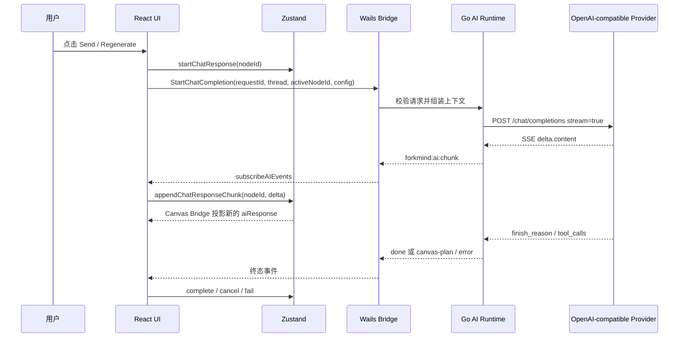

# ForkMind AI 模块架构指南

本文面向第一次接手 ForkMind AI 模块的开发者。目标不是介绍某个模型的 API，而是说明一次 AI 请求在 ForkMind 中如何从画布发起、如何组装上下文、如何经过 Wails 调用 OpenAI-compatible 服务、如何把流式结果安全地写回卡片，以及选区追问、父链上下文、参考卡片和画布提案分别处在数据流的什么位置。

## 1. 先建立整体认识

ForkMind 的 AI 模块可以看成四层：

| 层 | 主要职责 | 代表文件 |
| --- | --- | --- |
| UI 层 | 展示当前卡片、发送/停止按钮、选区操作、提案确认 | `App.tsx`、`RightEditorSidebar.tsx` |
| Store 层 | 保存会话树、卡片内容、父子关系、参考关系和请求中的文本 | `stores/conversationStore/store.ts` |
| Bridge 层 | 在 React 和 Go 之间传递结构化请求与事件 | `bridge/wailsBridge.ts`、`bridge/aiEvents.ts`、`ai_bridge.go` |
| AI 运行时层 | 组装上下文、发送 SSE、解析 tool call、校验画布提案 | `ai_context.go`、`openai_client.go`、`ai_canvas_plan.go` |

核心原则是：

1. **Zustand 是画布业务状态的唯一事实源**。tldraw 只是渲染投影。
2. **Go 负责上下文组装和网络请求**。React 不拼接完整 AI messages，也不直接请求模型。
3. **AI 返回的内容必须经过边界校验**。文本 chunk 经过事件字段校验，画布提案经过严格 JSON 和关系校验。
4. **模型不能直接写入画布**。普通回答先进入当前 Chat 的 `aiResponse`；画布批量修改必须等待用户 Accept。

## 2. 一次普通 AI 请求的完整时序



### 2.1 pointer / click 阶段

`RightEditorSidebar.tsx` 的 Send 按钮只把 `activeNode.id` 传给 `App.tsx`。UI 不负责读取整张画布，也不负责自己构造 messages。

### 2.2 Store 写入阶段

`useAICompletion.ts:startCompletion` 首先读取当前会话和目标卡片，然后调用 `startChatResponse(nodeId)`：

```ts
const requestId = createAIRequestId()
const requestThread = conversationState.activeThread

conversationState.startChatResponse(nodeId)
activeRequestRef.current = { requestId, threadId, nodeId }
```

`startChatResponse` 会清空旧回答、记录撤销基线并把节点置为 `streaming`。后续 chunk 不再重复创建历史快照，否则一次生成会产生几百条撤销记录。

### 2.3 Bridge 调用阶段

`bridge/wailsBridge.ts:startChatCompletionFromBridge` 只做 Wails 可用性检查、异常归一化和方法转发。它返回“请求是否启动成功”，不等待完整回答。

请求结构定义在 `bridge/contracts.ts`：

```ts
interface StartChatCompletionInput {
    requestId: string
    thread: ConversationThread
    activeNodeId: string
    config: {
        baseUrl: string
        apiKey: string
        model: string
    }
}
```

API Key 只存在运行时内存，`baseUrl` 和 `model` 才进入工作区设置持久化对象。

## 3. AI 上下文是如何组装的

Go 入口是 `ai_context.go:BuildAIRuntimeContext`。它接收 React 传来的当前会话快照和 `activeNodeId`，生成只供本次请求使用的 `AIRuntimeContextDTO`：

```go
type AIRuntimeContextDTO struct {
    ActiveNodeID string
    Messages     []OpenAIMessageDTO
    References   []AIReferenceDTO
}
```

组装顺序固定为：

1. 校验会话结构和当前节点。
2. 沿 `parentId` 向上收集主链。
3. 读取当前节点的 `referenceNodeIds`。
4. 生成 system prompt 和背景资料。
5. 把主链 Chat 卡片转换为 user/assistant 消息。

这样做的意义是：AI 只看到与当前问题有关的上下文，不会把整个画布 JSON 全量塞进请求。

## 4. `parentsCards` 的真实实现：parent 主链

项目没有 `parentsCards` 这个字段。这个概念由每张卡片上的：

```ts
parentId: string | null
```

表达。当前卡片沿 `parentId` 不断向上查找，得到一条从根节点到当前节点的有序链。这条链就是 AI 的主对话历史。

### 4.1 主链算法

`ai_context.go:collectMainChain` 使用游标和 `visitedIDs`：

```text
active card
  -> parent
      -> parent
          -> root
```

收集时是“当前到根”，返回前会反转为“根到当前”。因此消息顺序稳定：

```text
root user prompt
root assistant response
child user prompt
child assistant response
current user prompt
```

当前节点的旧 `aiResponse` 会被排除。这样点击 Regenerate 时，模型不会把旧答案当成已经确认的历史答案。

### 4.2 主链中不同卡片的处理

- Chat：进入 OpenAI 的 `user` / `assistant` 消息。
- Note、Image、Link、File：不伪装成对话角色，而是格式化为 system 背景资料。
- 缺失父节点、父链循环、当前节点不是 Chat、Prompt 为空：请求在 Go 层拒绝。

## 5. `referenceCards` 的真实实现：referenceNodeIds

参考卡片由当前节点的：

```ts
referenceNodeIds?: string[]
```

表达。它不是主对话历史，而是用户明确挂载给当前问题的补充资料。

### 5.1 参考卡片的收集规则

`ai_context.go:collectDirectReferences` 只读取当前节点的一层 `referenceNodeIds`：

1. 保持用户写入的顺序。
2. 自动跳过重复 ID。
3. 如果某个引用已经在 parent 主链中，则跳过，避免重复投喂。
4. 引用节点不存在时返回错误，不静默忽略。

注意：当前实现不会递归读取“参考卡片自己的参考卡片”。这是有意的边界，避免引用关系扩散成不可预测的大图遍历。

### 5.2 参考卡片如何进入 Prompt

参考资料会进入独立的 system 背景块：

```text
[补充参考 1 | node-id]
用户问题:
...

AI 回答:
...
```

它不会伪装成 `user` 或 `assistant` 消息，因此不会破坏主链的因果关系。系统提示词会告诉模型：这些资料只有在相关时引用，不相关时继续使用通用知识回答。

### 5.3 各种卡片的参考内容格式

`ai_context.go:formatReferenceCard` 只发送可解释的文本元数据：

- Chat：用户问题和 AI 回答。
- Note：笔记正文。
- Image：本地资源名称、MIME、大小、Alt Text、Caption。不会把二进制图片直接发送。
- Link：标题、URL、描述。不会联网抓取页面。
- File：文件名称、MIME、大小、描述。不会把文件二进制直接发送。

## 6. 选区追问的架构

选区追问不是特殊的 AI API，而是“带来源锚点的 Fork Chat”。

### 6.1 画布选区

`forkMindCardShape.tsx:captureCanvasTextSelection` 在文本区域 `pointerup` 时读取浏览器 Selection：

```ts
{
    sourceNodeId: shape.props.nodeId,
    field: "userPrompt" | "aiResponse" | ...,
    quote: selection.toString().trim(),
    startOffset: null,
    endOffset: null,
    origin: "canvas",
}
```

事件通过 `forkmind:canvas-text-selection` 发给 `App.tsx`。App 显示“追问选区”按钮，点击后调用：

```ts
forkChatNode({
    sourceNodeId: anchor.sourceNodeId,
    sourceAnchor: anchor,
})
```

Store 会创建一个新的 Chat 节点，并自动设置：

```text
new.parentId = sourceNodeId
new.sourceAnchor = selected text anchor
```

### 6.2 右侧编辑器选区

右侧 `Textarea` 可以获得精确的 `selectionStart` 和 `selectionEnd`，因此 `ConversationTextAnchor` 会额外保存字符偏移。右侧选区按钮直接调用 `onForkTextSelection`，其余流程与画布选区相同。

### 6.3 选区如何进入 AI 上下文

新卡片被发送时，`buildOpenAIMessages` 发现当前主链末端有 `sourceAnchor`，会在 system 背景中加入：

```text
[文本锚点 | 来源 node-id | 字段 aiResponse]
被选中的原文
```

因此模型知道当前问题是针对哪段原文的追问，但选区内容不会被伪装成新的 user 消息。

### 6.4 选区功能测试

1. 在画布 Chat 的 Prompt 或 Response 文本上拖选一段文字。
2. 松开后确认出现“追问选区”按钮。
3. 点击按钮，确认创建新的 Chat 卡片。
4. 查看新卡片右侧编辑器顶部的来源字段和引用文本。
5. 给新卡片输入 Prompt 并发送。
6. 查看模型是否围绕选区回答，而不是把整张卡片当成新问题。

当前画布选区的边界是：浏览器拖选结束位置仍在文本区域内时最稳定。如果拖到卡片外再松开，原文本节点可能收不到 `pointerup`。右侧编辑器因为有原生 `selectionStart/selectionEnd`，通常更稳定。

## 7. 系统提示词与上下文策略

系统提示词由 Go 的 `buildForkMindSystemPrompt` 统一生成，用户不能在 UI 中编辑。它由四类规则组成：

1. ForkMind 身份：模型是无限画布中的 AI 助手。
2. 上下文策略：画布资料是补充背景，不是知识边界。
3. 准确性策略：不能虚构不存在的画布内容，不确定时要明确说明。
4. 工具策略：只有用户明确要求生成或组织多张卡片时，才调用 `propose_canvas_plan`。

运行时还会根据上下文追加提示：

- 存在主链历史时，保持对话连续。
- 存在 reference 时，在相关时使用补充资料。
- 存在 source anchor 时，把问题理解为针对选区的追问。

这套设计解决了“新建一张空卡片就被系统提示词误导为必须等待画布资料”的问题：系统提示词始终存在，但画布资料是可选背景，不是回答前提。

## 8. 流式响应与请求生命周期

### 8.1 Go 侧

`ai_bridge.go:StartChatCompletion`：

1. 校验 `requestId`、Wails runtime、AI client。
2. 调用 `BuildAIRuntimeContext`。
3. 创建可取消的 `context.Context`。
4. 把取消函数注册到 `AIRequestManager`。
5. 在 goroutine 中运行 `runChatCompletion`。

`AIRequestManager` 保证一个请求 ID 只注册一次，并让 Stop 按 `requestId` 找到正确的取消函数。

### 8.2 OpenAI-compatible HTTP

`openai_client.go:StreamCompletion` 负责基础设施细节：

- 规范 Base URL 并补齐 `/chat/completions`。
- 校验 HTTP/HTTPS、模型名、messages 和 max tokens。
- 设置 `stream: true`、`Accept: text/event-stream` 和可选 Authorization。
- 逐行读取 SSE。
- 把 `delta.content` 交给回调。
- 按 tool call index 聚合工具调用参数。

Provider 的 HTTP 错误会被转换成稳定的 `BridgeError`，前端不依赖某个供应商的原始错误 JSON。

### 8.3 React 侧事件

`bridge/aiEvents.ts` 订阅四类 Wails 事件，并先把 payload 从 `unknown` 校验成 TypeScript 类型：

- `forkmind:ai:chunk`：追加文本。
- `forkmind:ai:done`：正常结束或取消。
- `forkmind:ai:error`：失败并显示错误。
- `forkmind:ai:canvas-plan`：等待用户审核的画布提案。

`useAICompletion.ts` 会同时检查 `requestId`、`nodeId` 和 `threadId`。过期请求或旧会话的事件会被丢弃，防止切换会话后旧流污染当前卡片。

## 9. Tool Calling 与 Canvas Plan

ForkMind 当前不是让模型直接调用很多 `createCard`、`createLink` 小工具，而是提供一个粗粒度工具：

```text
propose_canvas_plan
```

模型一次生成完整的节点和关系方案：

```ts
interface CanvasPlanNode {
    tempId: string
    cardType: "chat" | "note" | "image" | "link" | "file"
    content: CanvasPlanContentMap[CardType]
    parentTempId: string | null
    referenceTempIds: string[]
}
```

### 9.1 为什么是 propose 而不是 create

工具调用的本质是模型输出结构化意图。它不是用户授权，也不应该直接修改 Zustand。Go 只负责：

1. 接收完整 tool call。
2. 严格解码 JSON。
3. 检查卡片类型和字段。
4. 检查临时 ID、父关系、参考关系、自引用和循环。
5. 发送 `canvas-plan` 事件。

React 收到提案后，在右侧显示 Accept / Reject。只有点击 Accept，才调用 `conversationStore.applyCanvasPlan` 写入真实节点 ID、坐标和关系。

### 9.2 CanvasPlan 的安全边界

Go 和 React 都做一次校验：

- Go 防止非法 tool call 进入前端。
- React 防止未知 Wails payload 进入 Store。
- `additionalProperties: false` 和 `DisallowUnknownFields` 拒绝多余字段。
- 节点数量、文本长度和关系数量有限制。
- 关系必须引用同一份 plan 中存在的 `tempId`。

`tempId` 只在模型提案阶段存在。用户接受后由 Store 生成正式节点 ID，模型永远不负责生成持久化 ID。

## 10. 取消、错误和重试

### 10.1 取消

用户点击 Stop 后：

1. React 调用 `CancelChatCompletion({ requestId })`。
2. Go 调用对应 context cancel。
3. HTTP 流结束并发送 `done { cancelled: true }`。
4. Store 保留已经收到的文本。
5. 有文本时节点为 `done`，没有文本时恢复 `idle`。

### 10.2 错误

错误分为三层：

- 客户端前置错误：没有 Prompt、已有请求、配置缺失。
- Bridge 错误：Wails 未连接、Go runtime 不可用、请求 ID 无效。
- Provider 错误：Base URL、网络、HTTP 状态码、SSE 或 tool call JSON 错误。

所有错误都转换为：

```ts
interface BridgeErrorPayload {
    code: string
    message: string
    retryable: boolean
}
```

错误不会被吞掉。文本已经生成的情况下，错误状态仍保留已有回答，方便用户判断是否需要 Regenerate。

## 11. Markdown、图片和文件的边界

AI 返回的文本最终写入 `ConversationCard.aiResponse`，画布使用 `react-markdown` 渲染，并通过 `markdownRendering.tsx` 统一处理 GFM、LaTeX 和 sanitize。

图片和文件卡片目前作为 AI 上下文中的**文本元数据**使用：名称、MIME、大小、Alt Text、Caption 或 Description。系统不会默认读取本地二进制内容，也不会因为 Link 卡片自动联网抓取页面。

## 12. 新成员排查问题时的顺序

遇到“AI 没回复”时按这个顺序排查：

1. `RightEditorSidebar` 是否真的调用了 `onStartAIRequest`。
2. `useAICompletion.canStart` 是否因为 Prompt、已有请求或模型配置返回 false。
3. `startChatResponse` 是否把节点置为 `streaming`。
4. Wails 是否存在 `window.go.main.App.StartChatCompletion`。
5. Go `BuildAIRuntimeContext` 是否因为 parent、reference 或 Prompt 校验失败。
6. Provider 是否返回 2xx SSE。
7. `aiEvents.ts` 是否成功校验事件 payload。
8. `useAICompletion` 的 requestId、nodeId、threadId 是否仍匹配。
9. Store 是否收到 `appendChatResponseChunk`。

遇到“AI 上下文不对”时优先检查：

- 当前节点的 `parentId` 是否正确。
- `referenceNodeIds` 是否误把资料挂成了主链。
- 当前节点是否仍带着旧的 `aiResponse`。
- `sourceAnchor` 是否属于当前主链且字段类型匹配。
- 是否把整个 workspace JSON 错误地当成了模型输入。

## 13. 当前架构的扩展方向

后续可以在不改变 UI 和 Store 合同的前提下扩展：

1. 把 `BuildAIRuntimeContext` 抽象为可替换的 Context Builder，以支持更多上下文策略。
2. 为 reference 增加显式的递归深度或 token 预算，而不是无限递归。
3. 为图片增加用户主动授权的视觉输入通道，保持默认不发送二进制。
4. 为 tool call 增加更多提案类型，但仍坚持“模型提案 -> 用户确认 -> Store 写入”。
5. 为选区追问增加全局 `selectionchange` 监听，解决拖选到卡片外释放时的边界问题。
6. 为流式消息增加 token 预算、重试策略和 provider 能力探测。

扩展时最重要的约束不变：AI 可以提出意图，但业务状态只能由 Store 在明确的业务动作中写入。
